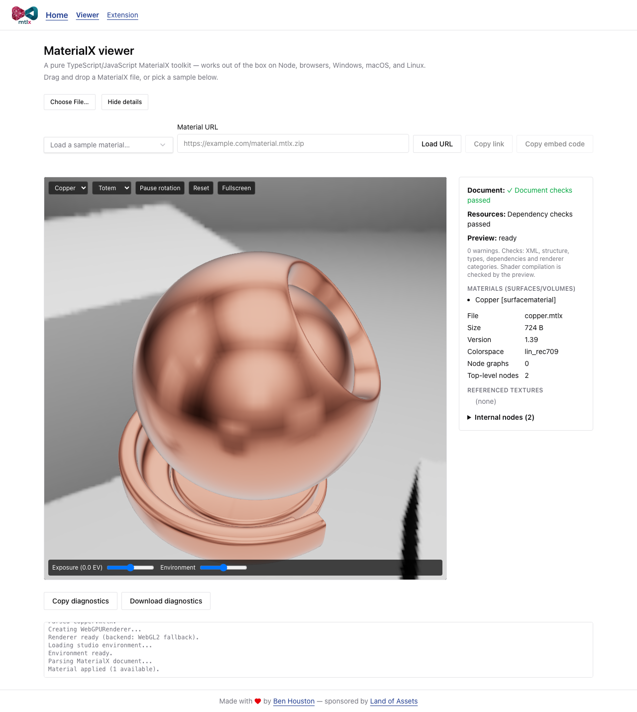

# mtlx


[](https://www.npmjs.com/package/mtlx-core)
[](https://github.com/bhouston/mtlx/actions/workflows/ci.yml)
[](https://github.com/bhouston/mtlx/blob/main/LICENSE)
[](https://mtlx.ben3d.ca)

_A TypeScript/JavaScript [MaterialX](https://materialx.org) toolkit for inspecting,
packaging, transforming, and previewing materials._

mtlx works with loose `.mtlx` documents and `.mtlx.zip` archives. Try the
[web viewer](https://mtlx.ben3d.ca), automate material preparation with the CLI, or embed the
library in your application. The root `mtlx-core` API is browser-safe and has no filesystem or
native imports. Node texture transforms use [sharp](https://sharp.pixelplumbing.com/), a native
image-processing dependency installed with the package.

Preview rendering uses three.js's MaterialX support. Validation checks selected document rules;
neither a successful check nor a preview guarantees full MaterialX conformance or identical
rendering in another application. Node tools target Node.js 22 or later.

[Open the copper sample](https://mtlx.ben3d.ca/viewer?materialUrl=https%3A%2F%2Fraw.githubusercontent.com%2Fbhouston%2Fmaterial-samples%2Fmain%2Fmaterials%2Fshowcase%2Fstandard_surface%2Fcopper%2Fcopper.mtlx)
to try the inspector immediately.



## Support

| Host              | Input and resources                                                               | Validation and preview                                                                             |
| ----------------- | --------------------------------------------------------------------------------- | -------------------------------------------------------------------------------------------------- |
| Browser inspector | Local XML/ZIP and HTTP(S) URLs; archives or remote URLs provide dependency access | All core rule groups; three.js preview with WebGPU or WebGL2 fallback                              |
| Desktop VS Code   | Saved XML/ZIP; dependencies through the workspace URI provider                    | All core rule groups; automatic saved-source/resource refresh; same three.js scene                 |
| Node CLI          | XML/ZIP and filesystem dependencies; Node.js 22+                                  | Selectable validation rule groups, packaging, Sharp texture optimization and local browser preview |
| Browser library   | Caller-supplied bytes and resource reader                                         | Browser-safe parsing, packaging and validation; GPU rendering via `mtlx-viewer`                    |

The viewers check node/port names, structure, types, dependencies and renderer categories.
Local loose files in the browser cannot provide sibling resources. Shader compilation runs in
the preview and may fail independently. Automated rendering coverage uses Chromium's WebGL2
fallback, including the extension's bundled webview; real editor/GPU combinations vary.

## Packages

| Package                                                                                         | Description                                                                                                                                                   |
| ----------------------------------------------------------------------------------------------- | ------------------------------------------------------------------------------------------------------------------------------------------------------------- |
| [`mtlx-core`](https://github.com/bhouston/mtlx/tree/main/packages/core)                         | Parse, validate, package, and transform MaterialX. Pure and browser-safe; Node helpers under `mtlx-core/node`, texture processing under `mtlx-core/textures`. |
| [`mtlx-cli`](https://github.com/bhouston/mtlx/tree/main/packages/cli)                           | The `mtlx` command: `check`, `info`, `view`, and `transform`/`x` (convert, pack, unpack, combine, resize textures).                                           |
| [`website`](https://github.com/bhouston/mtlx/tree/main/packages/website)                        | Drag-and-drop viewer and validator at [mtlx.ben3d.ca](https://mtlx.ben3d.ca), plus these docs.                                                                |
| [`mtlx-vscode-extension`](https://github.com/bhouston/mtlx/tree/main/packages/vscode-extension) | "Mtlx Viewer": preview, inspect, and convert MaterialX files inside VS Code.                                                                                  |
| [`mtlx-viewer`](https://github.com/bhouston/mtlx/tree/main/packages/viewer)                     | Shared three.js preview scenes and environment assets for applications.                                                                                       |

## Scripting

```sh
npm install mtlx-core
```

```ts
import { transform } from 'mtlx-core';
import { loadMaterialXPackage, writeMaterialXPackage } from 'mtlx-core/node';
import { resizeTextures } from 'mtlx-core/textures';

// Load a .mtlx (with its textures) or .mtlx.zip into memory.
const pkg = await loadMaterialXPackage('material.mtlx');

// Apply transforms in order.
await transform(pkg, resizeTextures({ maxImageSize: 2048, imageFormat: 'webp' }));

// Write back out as either format.
await writeMaterialXPackage(pkg, 'material.mtlx.zip');
```

In the browser, the root entry works on bytes and text with no filesystem:

```ts
import { checkMaterialXZipArchive, parseMaterialX, validateDocument } from 'mtlx-core';

const issues = validateDocument(parseMaterialX(xmlText));
const archiveIssues = checkMaterialXZipArchive(new Uint8Array(await file.arrayBuffer()));
```

See the [mtlx-core README](https://www.npmjs.com/package/mtlx-core) for the full API.

## Command line

```sh
npm install --global mtlx-cli
```

```sh
mtlx check material.mtlx
mtlx view material.mtlx                                        # local browser preview
mtlx info material.mtlx.zip --format json
mtlx x material.mtlx -o material.mtlx.zip                         # pack
mtlx x material.mtlx.zip -o out/material.mtlx                     # unpack
mtlx x material.mtlx -o material.mtlx.zip --max-image-size 2048 --image-format webp
mtlx x material.mtlx -o material.mtlx.zip --profile web           # resize; preserve compatible texture formats
mtlx x "{metal,wood,glass}.mtlx" -o combined.mtlx.zip             # combine
mtlx x "materials/*.mtlx" -o out/                                 # batch: one output file per input
```

See the [mtlx-cli README](https://www.npmjs.com/package/mtlx-cli) for the full reference.

## Contributing

See [CONTRIBUTING.md](https://github.com/bhouston/mtlx/blob/main/CONTRIBUTING.md) for setup,
testing, and release steps, and [CHANGELOG.md](https://github.com/bhouston/mtlx/blob/main/CHANGELOG.md)
for what has changed.

## Credits

Created by [Ben Houston](https://ben3d.ca), sponsored by [Land of Assets](https://landofassets.com).

The library design inspired by Don McCurdy's [glTF Transform](https://gltf-transform.dev).

## License

MIT
