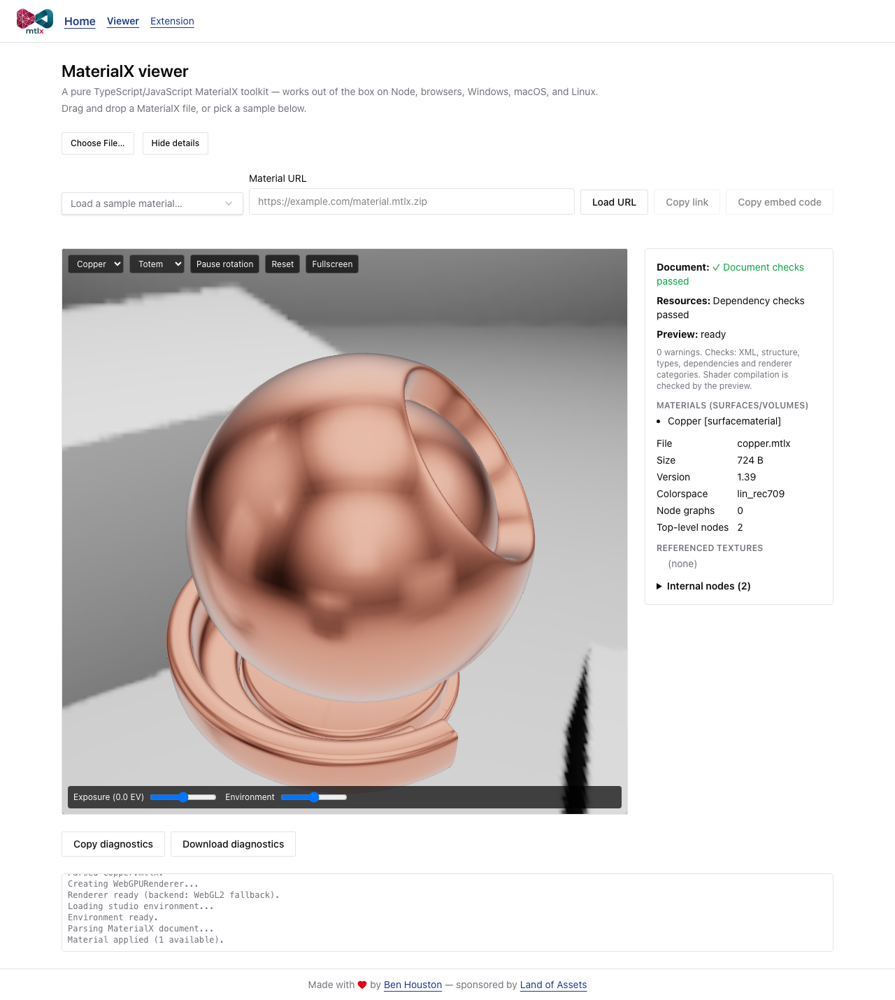

# mtlx


[](https://www.npmjs.com/package/mtlx-core)
[](https://github.com/bhouston/mtlx/actions/workflows/ci.yml)
[](https://codecov.io/gh/bhouston/mtlx)
[](https://github.com/bhouston/mtlx/blob/main/LICENSE)
[](https://mtlx.ben3d.ca)
[](https://discord.gg/wzQWaBBxup)

_A TypeScript/JavaScript [MaterialX](https://materialx.org) toolkit for inspecting,
packaging, transforming, and previewing materials._

The [Mtlx suite of web-focused MaterialX tools](https://mtlx.ben3d.ca) includes libraries, a CLI, a web viewer, and a VS Code extension.

mtlx works with loose `.mtlx` documents and `.mtlx.zip` archives. Try the
[web viewer](https://mtlx.ben3d.ca), automate material preparation with the CLI, or embed the
library in your application. The root `mtlx-core` API is browser-safe and has no filesystem or
native imports. Node texture transforms use [sharp](https://sharp.pixelplumbing.com/) for SDR
formats (webp/png/jpg/avif) and [hdrify](https://www.npmjs.com/package/hdrify) for HDR formats
(EXR/Radiance HDR), both installed with the package.

Preview rendering uses three.js's MaterialX support. Validation checks selected document rules;
neither a successful check nor a preview guarantees full MaterialX conformance or identical
rendering in another application. Node tools target Node.js 22 or later.

[Open the copper sample](https://mtlx.ben3d.ca/viewer?materialUrl=https%3A%2F%2Fraw.githubusercontent.com%2Fbhouston%2Fmaterial-samples%2Fmain%2Fmaterials%2Fshowcase%2Fstandard_surface%2Fcopper%2Fcopper.mtlx)
to try the inspector immediately.



## Support

| Host              | Input and resources                                                               | Validation and preview                                                                             |
| ----------------- | --------------------------------------------------------------------------------- | -------------------------------------------------------------------------------------------------- |
| Browser inspector | Local XML/ZIP and HTTP(S) URLs; archives or remote URLs provide dependency access | All core rule groups; three.js preview with WebGPU or WebGL2 fallback                              |
| Desktop VS Code   | Saved XML/ZIP; dependencies through the workspace URI provider                    | All core rule groups; automatic saved-source/resource refresh; same three.js scene                 |
| Node CLI          | XML/ZIP and filesystem dependencies; Node.js 22+                                  | Selectable validation rule groups, packaging, Sharp texture optimization and local browser preview |
| Browser library   | Caller-supplied bytes and resource reader                                         | Browser-safe parsing, packaging and validation; GPU rendering via `mtlx-viewer`                    |

The viewers check node/port names, structure, types, dependencies and renderer categories.
Local loose files in the browser cannot provide sibling resources. Shader compilation runs in
the preview and may fail independently. Automated rendering coverage uses Chromium's WebGL2
fallback, including the extension's bundled webview; real editor/GPU combinations vary.

## Packages

| Package                                                                                         | Description                                                                                                                                                   |
| ----------------------------------------------------------------------------------------------- | ------------------------------------------------------------------------------------------------------------------------------------------------------------- |
| [`mtlx-core`](https://github.com/bhouston/mtlx/tree/main/packages/core)                         | Parse, validate, package, and transform MaterialX. Pure and browser-safe; Node helpers under `mtlx-core/node`, texture processing under `mtlx-core/textures`. |
| [`mtlx-cli`](https://github.com/bhouston/mtlx/tree/main/packages/cli)                           | The `mtlx` command for local validation, preview, conversion, and MTLX.ai cloud login, upload, download, and search.                                          |
| [`mtlx-sdk`](https://github.com/bhouston/mtlx/tree/main/packages/sdk)                           | Public TypeScript client for the MTLX.ai REST API.                                                                                                            |
| [`website`](https://github.com/bhouston/mtlx/tree/main/packages/website)                        | Drag-and-drop viewer and validator at [mtlx.ben3d.ca](https://mtlx.ben3d.ca), plus these docs.                                                                |
| [`mtlx-vscode-extension`](https://github.com/bhouston/mtlx/tree/main/packages/vscode-extension) | "Mtlx Viewer for MaterialX": preview, inspect, and convert MaterialX files inside VS Code.                                                                    |
| [`mtlx-viewer`](https://github.com/bhouston/mtlx/tree/main/packages/viewer)                     | Shared three.js preview scenes and environment assets for applications.                                                                                       |

The prototype at `/editor` combines a reusable node library and React Flow graph with the
Three.js preview. See [mtlx-editor](packages/editor/README.md) for the component API and architecture.

## Scripting

```sh
npm install mtlx-core
```

```ts
import { transform } from 'mtlx-core';
import { loadMaterialXPackage, writeMaterialXPackage } from 'mtlx-core/node';
import { resizeTextures } from 'mtlx-core/textures';

// Load a .mtlx (with its textures) or .mtlx.zip into memory.
const pkg = await loadMaterialXPackage('material.mtlx');

// Apply transforms in order. Each source converts to the target sharing its dynamic range:
// SDR sources (png/jpg/...) use the first SDR target, HDR sources (exr/hdr) use the first HDR
// target. An HDR source with no HDR target requested is linearly clipped to SDR, no tone mapping.
await transform(
  pkg,
  resizeTextures({ maxImageSize: 2048, targets: [{ format: 'webp' }, { format: 'exr', compression: 'piz' }] }),
);

// Write back out as either format.
await writeMaterialXPackage(pkg, 'material.mtlx.zip');
```

In the browser, the root entry works on bytes and text with no filesystem:

```ts
import { checkMaterialXZipArchive, parseMaterialX, validateDocument } from 'mtlx-core';

const issues = validateDocument(parseMaterialX(xmlText));
const archiveIssues = checkMaterialXZipArchive(new Uint8Array(await file.arrayBuffer()));
```

See the [mtlx-core README](https://www.npmjs.com/package/mtlx-core) for the full API.

## Command line

```sh
npm install --global mtlx-cli
```

```sh
mtlx check "materials/*.mtlx"                                   # validate one file or a glob
mtlx view material.mtlx                                        # local browser preview
mtlx info material.mtlx.zip --format json
mtlx x material.mtlx -o material.mtlx.zip                         # pack
mtlx x material.mtlx.zip -o out/material.mtlx                     # unpack
mtlx x material.mtlx -o material.mtlx.zip --max-image-size 2048 --image-format webp
mtlx x material.mtlx -o material.mtlx.zip --image-format webp,exr:piz  # SDR->webp, HDR->EXR normalized to PIZ
mtlx x material.mtlx -o material.mtlx.zip --profile web           # resize; normalizes EXR compression to PIZ
mtlx x "{metal,wood,glass}.mtlx" -o combined.mtlx.zip             # combine
mtlx x "materials/*.mtlx" -o out/                                 # batch: one output file per input
mtlx login                                                        # authenticate with MTLX.ai
mtlx upload copper.mtlx.zip --name copper --user alice             # upload a public material
mtlx search copper                                                 # search the public library
mtlx download alice/copper -o copper.mtlx.zip                      # download a material
```

See the [mtlx-cli README](https://www.npmjs.com/package/mtlx-cli) for the full reference.

## Development

Read [CONTRIBUTING.md](https://github.com/bhouston/mtlx/blob/main/CONTRIBUTING.md) before starting a
change; release setup is in [RELEASING.md](https://github.com/bhouston/mtlx/blob/main/RELEASING.md)
and changes are listed in [GitHub Releases](https://github.com/bhouston/mtlx/releases).

```sh
pnpm install
pnpm build             # builds every package; the website build also regenerates the docs
pnpm test              # type-check + vitest across all packages
pnpm lint
pnpm docs:cli          # splice `mtlx --help` into packages/cli/README.md (commit the result)
pnpm docs:cli --check  # fails if that generated help is stale
node packages/cli/bin/cli.js check material.mtlx  # run the local CLI build
```

Test fixtures live under `assets/` and are shared by every package's tests.

**Node definitions.** The registry is generated from upstream MaterialX sources in
`submodules/MaterialX` (a local source copy, not a registered submodule; only needed when
regenerating). `pnpm generate:nodes [path/to/MaterialX]` regenerates the registry and upstream
license; `pnpm check:nodes` verifies them without rewriting. Commit the generated files with any
matching core model changes.

**Keep `mtlx-core` pure.** The root entry has no `node:` imports, no `Buffer`, and no native
modules; the website imports only the root entry, which is the check. Filesystem helpers go in
`packages/core/src/node.ts` (`mtlx-core/node`), anything needing sharp in
`packages/core/src/textures.ts` (`mtlx-core/textures`), and pure functions take bytes, text, or a
reader callback such as `ResourceReader`.

**API conventions.** Functions, not classes, with plain interfaces for data. A function that takes
options has an `XOptions` interface and, when any option has a default, an `X_DEFAULTS` const.
Whole-material operations are a `Transform` so they compose with `transform(pkg, ...)`. Validation
returns `MaterialXValidationIssue[]` and never throws on bad input. Tag every export with
`@category` (`Parsing`, `Validation`, `Packaging`, `Transforms`, or `Textures`) and keep each
package README current when an export's signature or behavior changes.

**VS Code extension.** Build the VSIX with `pnpm --filter mtlx-vscode-extension package`, not
`pnpm tsc`, which replaces the bundled host entry with unbundled output.

## Credits

Created by [Ben Houston](https://ben3d.ca), sponsored by [Land of Assets](https://landofassets.com).

The library design inspired by Don McCurdy's [glTF Transform](https://gltf-transform.dev).

## License

MIT

## Author

[Ben Houston](https://ben3d.ca), Sponsored by [Land of Assets](https://landofassets.com).
