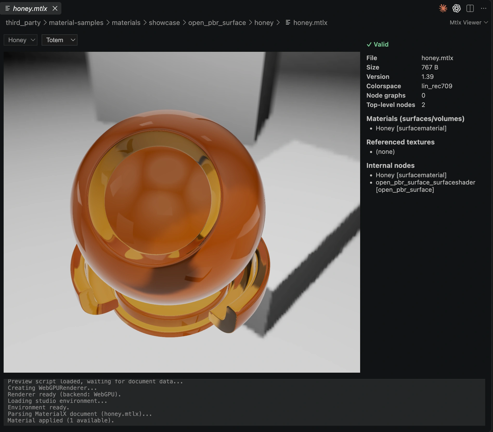

# Mtlx Viewer

Preview, inspect, and package [MaterialX](https://materialx.org) materials inside desktop VS Code.
Part of the [mtlx toolkit](https://github.com/bhouston/mtlx).

## Get started

In VS Code's Extensions view, search for **Mtlx Viewer** by **benhouston3d** and install it.
Open a `.mtlx` or `.mtlx.zip` file to preview it. To inspect or edit the source XML, use
**Reopen Editor With → Text Editor**; return with **Open with Mtlx Viewer** in the Command Palette.

The preview offers totem, sphere, and plane geometry and a selector for documents with multiple
materials. Its information panel lists version, materials, texture references, nodes, and
validation issues. Document, Resources and Preview report their status separately. Every core rule group runs: basic node/port checks, structure, types, recursive resources and renderer categories. Archive contents and included documents are checked too. Saved files and sibling resources refresh visible previews automatically;
use **Refresh** to reload manually. Material, geometry, camera, rotation and lighting settings survive tab switching. Unsaved text-editor edits are not previewed; save the source or use Refresh after saving.

## Inspect a material

Use **Pause rotation** to hold the object still, or **Reset** to restore its original orientation and
the camera's position, target and zoom. Reduced-motion preferences pause rotation automatically.
Arrow keys pan when the canvas is focused. **Fullscreen** requests webview fullscreen; if the
editor blocks it, use VS Code's **Toggle Full Screen** command. Exposure and environment intensity
adjust the inspection lighting. The bottom **IBL** dropdown switches between **Studio** and
**San Giuseppe Bridge** (the three-ntc website environment); its selection survives tab switching. Details stack below the preview in narrow panes and can be hidden;
internal nodes are collapsed initially. **Copy diagnostics** and **Download diagnostics** include
validation issues, resource failures and renderer logs for bug reports.

## Convert materials

Right-click one or more `.mtlx` / `.mtlx.zip` files in Explorer and choose **Convert to .mtlx**
or **Convert to .mtlx.zip**. Textures are carried along with the material. Converting to ZIP
packages the document and resources; it does not translate shaders into another rendering format.

Existing destination documents are preserved: if `wood.mtlx.zip` exists, packing `wood.mtlx`
creates `wood-2.mtlx.zip`. Files already in the requested format are skipped. A completion message
reports converted, skipped, and failed counts, with **Open** for outputs and **Details** for failures.

## Compatibility and troubleshooting

Rendering uses the shared `mtlx-viewer` three.js scene and requires working GPU acceleration
(WebGPU or its WebGL2 fallback). Preview coverage depends on three.js's MaterialX support;
a document passing validation may still use nodes or resources the renderer cannot display.
This is a material preview, not a promise of pixel-identical rendering across applications.

For loose `.mtlx` files, keep referenced textures alongside the document at their relative paths.
A `.mtlx.zip` containing its textures is the most portable input. Included libraries are validated recursively. Rendering library-defined nodes still depends on the renderer. Remote HTTP textures require a filesystem provider for that URI scheme; unsupported reads appear in resource diagnostics.
Sibling resolution preserves URI scheme and authority, including remote workspaces; it depends on the filesystem provider supporting reads and file watching. The extension uses desktop extension-host APIs; browser-hosted VS Code is not supported.

If rendering fails, read the error below the preview and the **Mtlx Viewer** Output channel.
Try a packaged material to distinguish missing resources from renderer support problems. Include
VS Code version, operating system, and a shareable minimal material in a
[bug report](https://github.com/bhouston/mtlx/issues).

Automated coverage exercises the provider's ready/refresh/disposal races and remote URI resource
watching with a mocked VS Code API, plus the actual bundled webview in Chromium (rendering,
recreation, keyboard controls and reduced motion). This does not certify every real editor/GPU
combination. The manifest requires VS Code 1.85 or later. Marketplace and Open VSX should both
publish the same packaged README and VSIX.

## Author

[Ben Houston](https://ben3d.ca), sponsored by [Land of Assets](https://landofassets.com).
